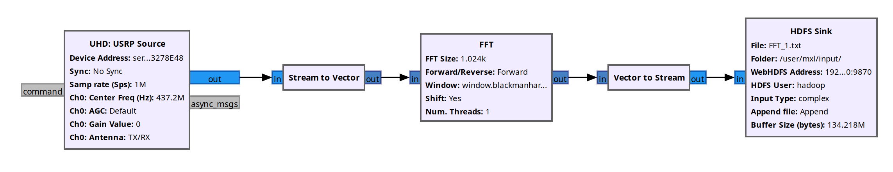
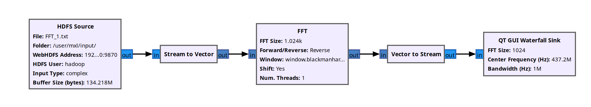

[](https://www.gnu.org/licenses/gpl-3.0) 

# gr-hdfs

gr-hdfs is an Out-Of-Tree (OOT) GNU Radio module designed to enable seamless interaction with Hadoop Distributed File System (HDFS). It provides two custom blocks:

1. **HDFS Sink**: Functions similarly to the built-in File Sink block but writes data to HDFS.
2. **HDFS Source**: Functions similarly to the built-in File Source block but reads data from HDFS.

This module uses WebHDFS to simplify working with HDFS within the GNU Radio framework, enabling new possibilities for integrating big data processing pipelines.

---

## Installation

### Prerequisites

- GNU Radio 3.10.
- CMake (minimum version 3.10 recommended).
- Python `requests` library.
- WebHDFS configured within your Hadoop cluster.

### Steps

#### Standard Installation

```bash
git clone https://github.com/mxl-space/gr-hdfs.git
cd gr-hdfs
mkdir build
cd build
cmake ..
make
sudo make install
sudo ldconfig
```

#### Installation in a Conda Environment

If using a Conda environment, you need to specify the Python executable and CMake installation directory:

```bash
conda activate <ENV_NAME>
git clone https://github.com/mxl-space/gr-hdfs.git
cd gr-hdfs
mkdir build
cd build
cmake .. -DPYTHON_EXECUTABLE=~/miniforge3/envs/<ENV_NAME>/bin/python -DCMAKE_INSTALL_PREFIX=~/miniforge3/envs/<ENV_NAME>
make
sudo make install
sudo ldconfig
```

Replace `<ENV_NAME>` with the name of your Conda environment.

---

## Usage

Once installed, the `HDFS Sink` and `HDFS Source` blocks will appear in your GNU Radio Companion (GRC) block library. You can use them like any other blocks in your flowgraph. Configure the HDFS file paths and other parameters in the block properties.

### Example

Here’s an example use case:

1. **HDFS Sink**: Save data from a signal source to an HDFS file.



3. **HDFS Source**: Read the saved data from HDFS and process it in GNU Radio.



---

## Contributing

Contributions are welcome! Feel free to open an issue or submit a pull request on GitHub if you encounter any bugs or have feature requests.

---

## License

This project is licensed under the GPL-3.0 License. See the LICENSE file for details.

